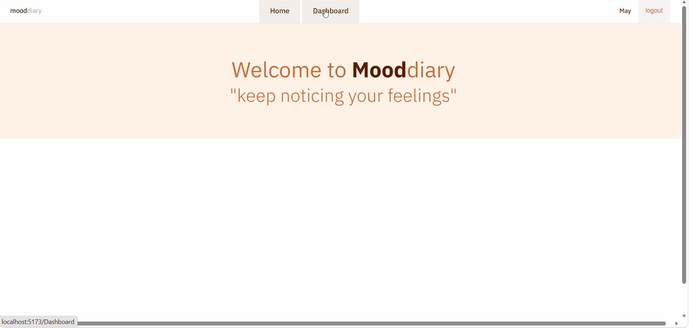
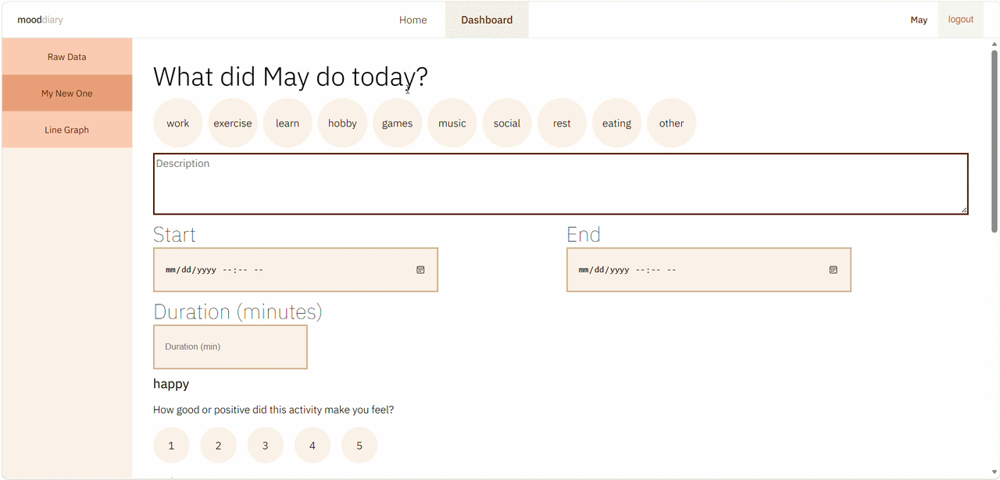
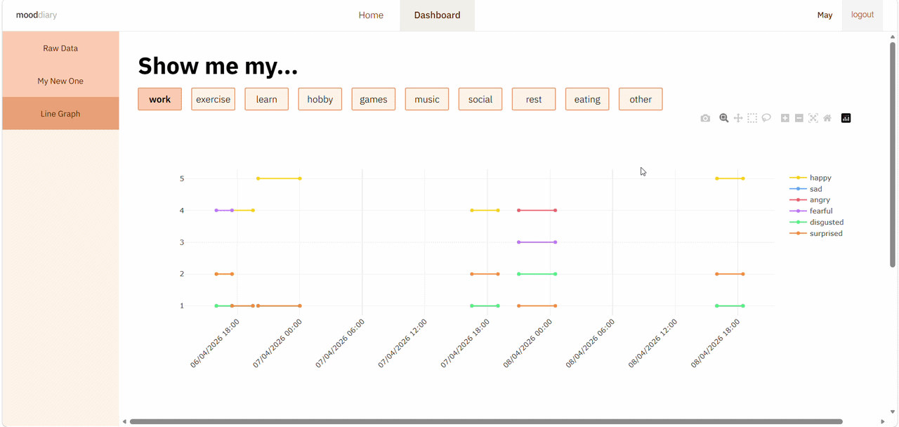

# Mood Diary

Mood Diary is a full-stack web app that lets you log daily activities and rate your emotional response to each one (happy, surprised, angry, annoyed, and more). Your mood scores are then plotted on an interactive line graph so you can spot patterns over time.

---

## Features

- **Register & Login** — Secure authentication with JWT and hashed passwords
- **Log Activities** — Record what you did and score your mood for each one
- **Visualize Your Feelings** — See your mood trends on an interactive Plotly graph

---

## Tech Stack

| Layer    | Technologies                              |
|----------|-------------------------------------------|
| Database | MongoDB                                   |
| Backend  | Express, bcrypt, cookie-parser, jsonwebtoken |
| Frontend | React, CSS, Plotly                        |

---

## Installation

### Prerequisites

- [Node.js](https://nodejs.org/)
- [MongoDB](https://www.mongodb.com/) running locally on `localhost`

---

### 1. Clone the Repository

```bash
git clone https://github.com/ZERRY-000/mood-diary.git
cd mood-diary
```

### 2. Start MongoDB

Make sure your local MongoDB instance is running on the default port (`27017`).

---

### 3. Configure Environment Variables

**Frontend** — create a `.env` file inside the `frontend/` folder:

```env
VITE_API_URL=http://localhost:3000/api/v1
```

**Backend** — create a `.env` file inside the `backend/` folder:

```env
JWT_SECRET=<your-secret-key>
```

> Replace `<your-secret-key>` with any long, random string.

---

### 4. Install & Run

**Frontend:**

```bash
cd frontend
npm install
npm run dev
```

**Backend:**

```bash
cd backend
npm install
npm run dev
```

The app should now be running. Open your browser and visit the URL shown in your frontend terminal (typically `http://localhost:5173`).

---

## 📸 Screenshots

### See Your Data


### Record Your Activity


### Survey Your Behavior



---
